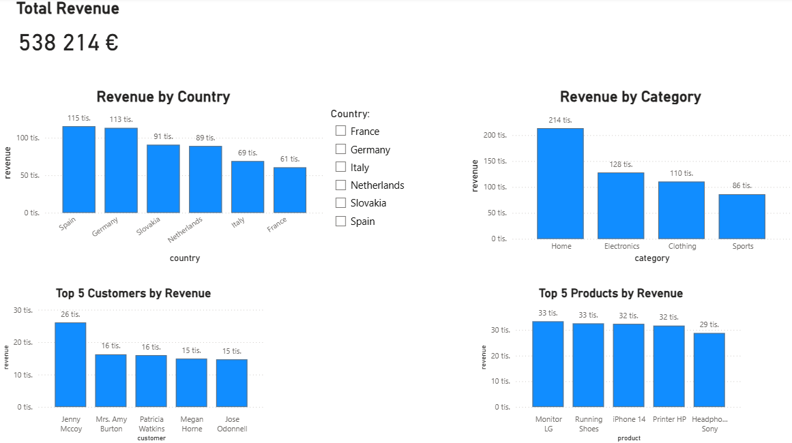

# 📊 E-commerce Data Analysis (SQL + Power BI)

## 📌 Project Overview

This project analyzes e-commerce sales data using SQL and presents key insights through an interactive Power BI dashboard.

The main objective was to transform raw transactional data into meaningful business insights and visualize them in a clear and interactive way.

---

## 🧠 Tools & Technologies

* SQL (joins, aggregations, CTEs)
* Power BI (data visualization & dashboarding)

---

## ⚙️ Workflow

1. Extracted and prepared transactional data (orders, customers, products)
2. Wrote SQL queries to calculate key metrics:

   * revenue by country
   * revenue by customer
   * revenue by category
   * revenue by product
3. Exported results into structured datasets
4. Built an interactive dashboard in Power BI

---

## 📊 Dashboard Features

* **Revenue by country** overview
* **Top 5 customers** by revenue
* **Revenue by product category**
* **Top 5 products** by revenue
* **Interactive filtering by country** (all visuals update dynamically)

---

## 📊 Key Insights

* Spain and Germany generate the highest revenue
* Electronics and Home categories dominate total sales
* Revenue is concentrated among top-performing customers and products

---

## 📁 Project Structure

* `/sql` → SQL queries used for analysis
* `/dashboard` → Power BI dashboard (.pbix) and screenshot
* `/data` → dataset used for analysis

---

## 📸 Dashboard Preview

---

## 🚀 What I Learned

* Writing multi-table SQL queries using joins and aggregations
* Using CTEs for structured data transformation
* Designing interactive dashboards in Power BI
* Connecting backend data logic with frontend visualization
